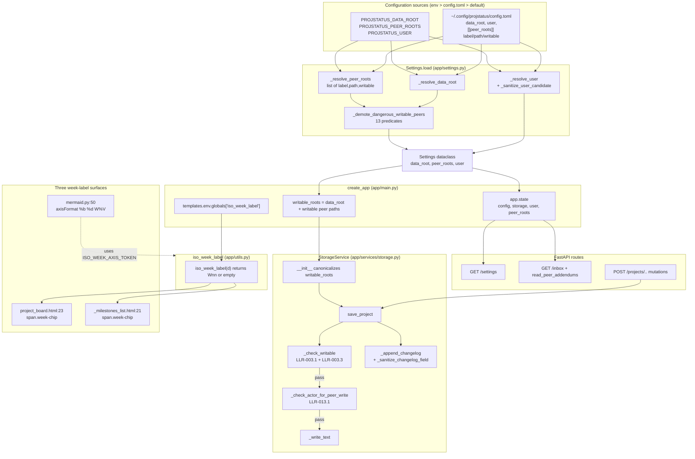
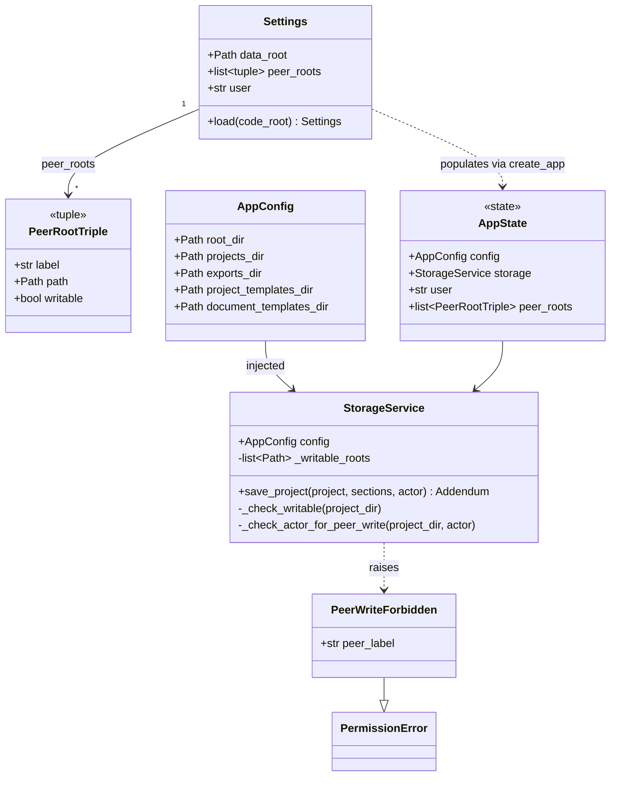

# ProjStatus — Batch 2026-05-04-batch-01 — Functional Description

> **Audience.** Developers joining the project, or reviewers maintaining it later.
> **Companion.** A non-technical executive summary lives at `.dev-flow/06-docs/executive-summary.md`.
> **Authority.** Code paths cited here are pinned in `.dev-flow/06-docs/traceability-matrix.md`. When the two diverge, the matrix wins.

---

## 1. Scope of this batch

This batch added per-peer write-mode for the cross-folder inbox, an ISO 8601 calendar-week indicator on tasks/milestones/Gantt, and a non-mutating Settings page. It hardened the existing actor-attribution flow with input sanitization (Settings.user, CHANGELOG fields) and a writable-roots gate inside `StorageService`. US-001 (configurable data root) was retained from PR #18 as the foundation US-005's Settings page surfaces. Net change: ~+1100 lines across `app/settings.py`, `app/services/storage.py`, `app/services/mermaid.py`, `app/utils.py`, `app/main.py`, three Jinja templates, and nine test files. Phase 4 closed with **38/38 TCs PASS** and zero regressions against `main`.

---

## 2. The four user-facing capabilities

### 2.1 US-002 — Per-peer writable peer roots

**What it does.** A peer root configured in `~/.config/projstatus/config.toml` with `writable = true` becomes a legitimate write target for `StorageService.save_project`. Mutations on that peer's projects (creating tasks, editing milestones, etc.) flow through the same code path used for own projects and produce normal addendums + CHANGELOG.md lines. Peer roots without the flag (or with `writable = false`, or omitting the key) remain read-only — `save_project` raises `PeerWriteForbidden` (a `PermissionError` subclass) and writes zero bytes to disk.

**How to configure.** Edit `~/.config/projstatus/config.toml`:

```toml
[[peer_roots]]
label = "alice"
path  = "/Users/me/OneDrive/Alice-ProjStatus"
writable = true   # opt-in; omitting the key resolves to false
```

The `PROJSTATUS_PEER_ROOTS` env-var format (`label=path,...`) has no syntax for `writable` and always resolves to `False` per LLR-001.1. Restart the app to pick up changes — there is no hot-reload.

**Defensive demotion.** At startup, `Settings.load` post-passes the resolved peer triples through `_demote_dangerous_writable_peers` (`app/settings.py:162`). Any writable entry whose canonicalized path matches one of 13 dangerous-path predicates (filesystem root, home dir, ancestor of `data_root`, sensitive home-dir children, POSIX system dirs, Windows `%APPDATA%`/`%LOCALAPPDATA%`/`%PROGRAMDATA%`) is silently demoted to `writable=False` and a one-time stderr warning is emitted naming the matched predicate. See §7.

**Containment-check hardening.** The writable-roots gate (`StorageService._check_writable`, `app/services/storage.py:601`) canonicalizes both `project_dir` and every entry of `self._writable_roots` via `Path.resolve(strict=False)`, then uses `Path.is_relative_to` for symlink/`..`/Windows-alias-safe containment (LLR-003.3). A symlink inside a writable peer pointing OUT of the peer (e.g., `peer-alice/projects/evil → /etc/cron.d/`) is rejected because the resolved target is not relative to any resolved root.

**Where it lives in the code.**
- Config schema: `app/settings.py:83` (`_resolve_peer_roots` returns `(label, path, writable)` triples).
- Demotion: `app/settings.py:106` (`_dangerous_writable_predicate`) + `app/settings.py:162` (`_demote_dangerous_writable_peers`) called from `Settings.load`.
- Plumbing into the service: `app/services/storage.py:127` (`StorageService.__init__` accepts `writable_roots: list[Path] | None`); `app/main.py:62-66` passes `[data_root, *writable_peer_paths]`.
- Gate: `app/services/storage.py:601` (`_check_writable`), invoked from `save_project` at `app/services/storage.py:531`.
- Exception type: `app/services/storage.py:40` (`PeerWriteForbidden(PermissionError)`).

**Validation status.** 6 LLRs (LLR-001.1, LLR-001.2, LLR-002.1, LLR-003.1, LLR-003.2, LLR-003.3) + 1 (LLR-012.1) covered by 11 TCs (TC-001/-002/-003/-012/-015/-016/-017/-018/-019/-020/-034). All PASS.

---

### 2.2 US-003 — Inbox attribution + identity gate + sanitization

**What it does.** Three pieces glued together so the inbox stays trustworthy across writable peers:

1. **Local-actor attribution on writable-peer mutations** (HLR-004 / D-005 / A-003). When the local app writes into a writable peer root, the recorded `actor` on the addendum and the CHANGELOG.md line is the LOCAL operator (`app.state.user`), not the peer's owner. The peer's own inbox — when they configure us as a peer root — will then show "alice did X" rather than "self did X".
2. **Identity-required peer writes** (HLR-013 / LLR-013.1). If `actor` is empty, `None`, or the literal string `"unknown"`, AND the target path lies under a writable peer (NOT under `data_root`), `save_project` raises `PeerWriteForbidden` with a message identifying the cause. Writes against `data_root` itself are exempt (A-010), so an unconfigured single-user machine still works for own-projects.
3. **Sanitization of identity inputs** (LLR-013.2 / LLR-013.3). The user string going INTO addendums is stripped of control chars + Unicode bidi/zero-width overrides + length-capped at 64 chars. The headline/note going INTO `CHANGELOG.md` is escape-then-cap'd against newline forgery, markdown-link injection, HTML-tag injection, and pipe-based table-render hijacking.

**Inbox display.** `app/templates/inbox.html` renders peer rows differently from own rows: the peer's actor field is qualified as `<actor> <em class="inbox-claimed">(claimed)</em>` next to the `peer · <label>` chip. This means a peer addendum's `actor` value cannot visually masquerade as a local-app actor — the qualifier is greppable for tests (TC-024).

**Gate ordering — N-S-001 fix.** Both `_check_writable` (LLR-003.1) and `_check_actor_for_peer_write` (LLR-013.1) sit in `save_project` BEFORE the first `_write_text`. `_check_writable` runs FIRST so a non-writable target produces a writability error regardless of actor state — see TC-035c. This makes test assertions deterministic and matches the rationale in the requirements (HLR-013 statement, last sentence).

**Where it lives in the code.**
- Actor passthrough: `app/services/storage.py:526` (`save_project` accepts `actor`); routes call `actor=current_actor(request)` (`app/main.py:1329`).
- Identity gate: `app/services/storage.py:618` (`_check_actor_for_peer_write`).
- User sanitizer: `app/settings.py:38` (`_sanitize_user_candidate`); pipeline in `app/settings.py:57` (`_resolve_user`).
- CHANGELOG sanitizer: `app/services/storage.py:67` (`_sanitize_changelog_field`); applied in `app/services/storage.py:93` (`_append_changelog`).
- Peer-row template: `app/templates/inbox.html:32-38`.
- Throwaway-service safety: `app/services/storage.py:862` (`StorageService(peer_config, writable_roots=[])` — peer reads can never accidentally write).

**Validation status.** 3 HLRs + 6 LLRs (LLR-004.1, LLR-005.1/.2/.3, LLR-013.1/.2/.3) covered by TC-004/-005/-013/-021/-022/-023/-024/-035 (a/b/c) + the parametrized TC-036 (7 sub-functions) and TC-037 (8 sub-functions). All PASS. CR-001 (entity-bypass) closed in increment 6a; CR-005 (zero-width Unicode) folded into `_USER_STRIP_CHARS`.

---

### 2.3 US-004 — ISO 8601 calendar-week indicator

**What it does.** A small `Wnn` chip is rendered next to date metadata on three surfaces:

| Surface | What renders | Example |
|---|---|---|
| Task card on Kanban board | `Wnn` for `start_date` alone, or `Wnn–Wmm` if `due_date` lies in a different ISO week | `W18–W19` |
| Milestone row on Plan tab | `Wnn` for `target_date` (single-date object) | `W19` |
| Mermaid Gantt axis | Week token inside the `axisFormat` line — never on a per-task or per-milestone line | `Apr 26 (W17)` |

Tasks with no `start_date` render no chip (the `<span class="week-chip">` is omitted entirely). End-before-start dates collapse to start-only without raising.

**How it's computed.** `app/utils.py:42` exposes `iso_week_label(d: date | None) -> str` returning `f"W{d.isocalendar().week:02d}"` for non-null `date`, empty string for `None`. Registered as a Jinja global at `app/main.py:76` so templates can call `{{ iso_week_label(task.start_date) }}` without per-route context injection. Year boundaries follow `date.isocalendar()`: `2024-12-30 (Mon)` → `W01` of ISO 2025; `2020-12-31 (Thu)` → `W53`.

**Mermaid axis token.** The `axisFormat` line is the ONLY round-trip-safe place to surface a week label — `mermaid.py::import_timeline` only round-trips a fixed token set, so any per-task `W…` would flip `sync_state.timeline_is_app_owned` to `False`. The chosen token is exposed as a module-level constant `ISO_WEEK_AXIS_TOKEN: Final[str] = "%V"` at `app/services/mermaid.py:16` and consumed by `render_timeline` at `app/services/mermaid.py:50` as `axisFormat %b %d (W%V)`. If a future Mermaid CDN version pinned in `app/templates/base.html` does not render `%V` as a week number, switch the constant to a documented fallback (e.g., `%U`); TC-038's `%V`-absence assertion is conditional on the constant value (CR-003 closure).

**Where it lives in the code.**
- Helper: `app/utils.py:42-45`.
- Jinja registration: `app/main.py:76`.
- Task chip: `app/templates/partials/project_board.html:23`.
- Milestone chip: `app/templates/partials/_milestones_list.html:21`.
- Mermaid axis: `app/services/mermaid.py:16` + `:50`.

**Validation status.** 4 HLRs + 6 LLRs covered by TC-006/-007/-008/-009/-014/-025/-026/-027/-028/-029/-030/-038. All PASS pytest. **TC-038's `%V`-renders-as-`Wnn` browser check is a 5-minute manual UAT (G-009)** — pytest cannot verify what the Mermaid CDN does in the SVG. See §9 and `04-validation.md` §5.1.

---

### 2.4 US-005 — Read-only Settings page

**What it does.** `GET /settings` renders the resolved per-machine configuration:

- `data_root` as an absolute path string.
- Each peer root as a row showing `label`, `path`, writable state (`RW` or `RO`), and reachability (`reachable` or `unreachable`). Reachability is computed per request via `Path(path).resolve(strict=False).is_dir()` — i.e., the rendered HTML may differ between renders if a network drive comes and goes.
- The configured `user`.

The page is non-mutating by design (D-002): no `<form>`, no `<input>`, no `<button type="submit">`, no `method="post"` markup anywhere in `app/templates/settings.html` — the `405 Method Not Allowed` response on POST/PUT/PATCH/DELETE is enforced by the absence of any handler, not by an explicit reject (LLR-011.1).

**How to use it.** Sidebar link is wired up via `build_sidebar_context`. To change anything displayed, edit env vars or `~/.config/projstatus/config.toml` and restart the app — the Settings page is a confirmation surface, not an editor.

**Where it lives in the code.**
- Route: `app/main.py:248` (`@app.get("/settings", name="settings")`).
- Template: `app/templates/settings.html` (extends `base.html`; cards for data_root / user / peer_roots).
- Sidebar wiring: `app/templates/base.html:56-58` and `app/main.py:1362` (active-route highlight).

**Validation status.** 2 HLRs + 3 LLRs covered by TC-010/-011/-031/-032/-033 (4 parametrized HTTP methods × `/settings` for the 405 check). All PASS. TC-032 is the one inspection-method TC in the batch — a `grep` against the template asserts the non-mutating invariant holds at the source level.

---

## 3. Architecture diagram



---

## 4. Sequence diagram for the writable-peer write flow

```mermaid
sequenceDiagram
    actor Operator
    participant Browser
    participant Route as FastAPI route<br/>(app/main.py)
    participant Storage as StorageService
    participant CheckW as _check_writable<br/>(LLR-003.1)
    participant CheckA as _check_actor_for_peer_write<br/>(LLR-013.1)
    participant FS as Disk

    Operator->>Browser: edit task on writable peer
    Browser->>Route: POST /projects/<peer-slug>/tasks/<id>
    Route->>Route: actor = current_actor(request)<br/>= app.state.user
    Route->>Storage: save_project(project, sections,<br/>actor=<user>)
    Storage->>Storage: project_dir = projects_dir / slug
    Storage->>CheckW: resolve(project_dir),<br/>resolve(writable_roots)
    alt project_dir not under any writable root
        CheckW-->>Storage: raise PeerWriteForbidden<br/>(writability message)
        Storage-->>Route: PermissionError
        Route-->>Browser: 500 / error redirect
        Note over CheckA,FS: CheckA never runs;<br/>zero bytes written
    else under writable root
        CheckW-->>Storage: ok
        Storage->>CheckA: actor in {empty, None, "unknown"}?<br/>under data_root?
        alt actor missing AND under writable peer (NOT data_root)
            CheckA-->>Storage: raise PeerWriteForbidden<br/>(actor message)
            Storage-->>Route: PermissionError
            Note over FS: zero bytes written
        else actor ok OR under data_root (A-010 carve-out)
            CheckA-->>Storage: ok
            Storage->>FS: _write_text(content.md, ...)
            Storage->>FS: _write_text(timeline.mmd)
            Storage->>FS: _write_text(project.json)
            Storage->>FS: _write_text(history/<ts>.json)
            Storage->>FS: _append_changelog<br/>+ _sanitize_changelog_field
            Storage-->>Route: Addendum
            Route-->>Browser: 303 redirect
        end
    end

    Note over CheckW,CheckA: Gate ordering (N-S-001 fix):<br/>writability FIRST, actor SECOND.<br/>A non-writable + actor=unknown call<br/>raises a writability error,<br/>not an actor error (TC-035c).
```

---

## 5. Data shape: peer-roots tuple evolution

| Source | Before this batch | After this batch |
|--------|---|---|
| `Settings.peer_roots` | `list[tuple[str, Path]]` | `list[tuple[str, Path, bool]]` |
| `_resolve_peer_roots` return type | `list[tuple[str, Path]]` | `list[tuple[str, Path, bool]]` |
| `read_peer_addendums(...)` signature | `list[tuple[str, Path]]` | `list[tuple[str, Path, bool]]` (3rd elem ignored per LLR-005.1) |
| `StorageService.__init__` | `(config)` (one positional arg) | `(config, writable_roots: list[Path] \| None = None)` |
| `app.state.peer_roots` | 2-tuples | 3-tuples |
| Inbox HTML for peer rows | `actor` rendered raw | `<actor> <em>(claimed)</em>` qualifier + `peer · <label>` chip (LLR-005.3) |
| Throwaway peer-read service | `StorageService(peer_config)` | `StorageService(peer_config, writable_roots=[])` (LLR-005.2 — fail-closed) |
| `save_project` exception type for non-writable | n/a (no gate existed) | `PeerWriteForbidden(PermissionError)` |
| Module-level Mermaid week token | n/a | `ISO_WEEK_AXIS_TOKEN: Final[str] = "%V"` (`app/services/mermaid.py:16`) |



---

## 6. Configuration reference

| Setting | What it does | Format / type | Default | Example |
|---|---|---|---|---|
| `PROJSTATUS_DATA_ROOT` (env) | Top-level folder containing `projects/`, `exports/`, `project_templates/`, `document_templates/`. Auto-`mkdir -p`'d at startup; if the parent doesn't exist either, the app exits loudly so a typo doesn't silently land elsewhere. | absolute path string | repo root | `PROJSTATUS_DATA_ROOT=/Users/me/OneDrive/ProjStatus` |
| `PROJSTATUS_PEER_ROOTS` (env) | Comma-separated `label=path` pairs surfaced read-only in the inbox. **Env-var format has no syntax for `writable`** — every entry resolves with `writable=False`. Use `config.toml` to opt a peer into write mode. | `label=path,label=path` | empty | `PROJSTATUS_PEER_ROOTS=alice=/mnt/alice/PS,bob=/mnt/bob/PS` |
| `PROJSTATUS_USER` (env) | Username recorded on every addendum and CHANGELOG.md line. Sanitized per LLR-013.2: `\r`/`\n` rejects the source, control chars + bidi/zero-width Unicode are stripped, length capped at 64. | string (≤64 chars after sanitize) | `os.getlogin()` then `"unknown"` | `PROJSTATUS_USER=javier` |
| `data_root` (`config.toml`) | Same as the env var, plaintext key. Env var wins if both set. | string | repo root | `data_root = "/Users/me/OneDrive/ProjStatus"` |
| `user` (`config.toml`) | Same as the env var. Env var wins if both set. Same sanitization. | string | inherited from env / `os.getlogin()` | `user = "javier"` |
| `[[peer_roots]]` (`config.toml`) | TOML array of tables; each entry needs `label` + `path`, optionally `writable = true`. **Only this source can opt a peer into write mode.** Non-bool values for `writable` coerce to `False` (LLR-002.1). | TOML array of tables | empty | (see below) |

```toml
[[peer_roots]]
label = "alice"
path = "/mnt/alice/PS"
writable = true
```

**Trust note (Constraints §2.4 of `01-requirements.md`).** `~/.config/projstatus/config.toml` is plaintext — the operator trusts the OS-level file permissions on `~/.config`. A writable peer-path entry can disclose collaborator filesystem layout. Recommend `chmod 600` on POSIX; on Windows, the file inherits the user-profile ACL by default. The app does not enforce a permission-check gate at startup.

---

## 7. Defensive predicates (LLR-012.1)

`_dangerous_writable_predicate(resolved_path, data_root)` (`app/settings.py:106`) returns one of the following short predicate names when a writable peer-root entry is unsafe, or `None` when it is safe. Demotion happens in `_demote_dangerous_writable_peers` (`app/settings.py:162`); each demoted entry emits one stderr warning per process lifetime.

| # | Predicate name | What it matches |
|---|---|---|
| 1 | `filesystem-root` | `Path("/")` (POSIX) or any Windows drive root (`C:\`, `D:\`, …) |
| 2 | `home-dir` | `Path.home().resolve()` itself |
| 3 | `data-root-ancestor` | Any path of which the resolved `data_root` is a descendant (incl. `data_root` itself) |
| 4 | `ssh-credentials` | `~/.ssh` and any descendant |
| 5 | `aws-credentials` | `~/.aws` and any descendant |
| 6 | `config-dir` | `~/.config` and any descendant |
| 7 | `gnupg-credentials` | `~/.gnupg` and any descendant |
| 8 | `kube-config` | `~/.kube` and any descendant |
| 9 | `docker-config` | `~/.docker` and any descendant |
| 10 | `system-bin:/etc`, `…:/usr`, `…:/var`, `…:/bin`, `…:/sbin` | POSIX system directories (each is a separate predicate row reusing the `system-bin` family name) |
| 11 | `windows-appdata` | `%APPDATA%` (resolved via `os.environ`; skipped silently if env unset) |
| 12 | `windows-localappdata` | `%LOCALAPPDATA%` |
| 13 | `windows-programdata` | `%PROGRAMDATA%` |

**Warning format.** `WARNING: peer-root '<label>' demoted to read-only — path <resolved-path> is unsafe to mark writable (matched: <predicate-name>)` — emitted via `print(..., file=sys.stderr)`, deduplicated by `(label, resolved_path)` against `_DEMOTED_WARNED: set[str]`.

**Open follow-up.** CR-006 (MEDIUM, deferred) proposes adding venv/site-packages paths (`~/.venv`, `~/venv`, `~/.local`, `~/AppData/Local/Programs/Python`) to the predicate list. R-011 (post-mortem item 4) proposes moving from this block-list to an allow-list of explicitly-safe locations — out of scope this batch.

---

## 8. Sanitization pipelines

### 8.1 `_sanitize_user_candidate` (LLR-013.2)

`app/settings.py:38`. Applied per-source inside `_resolve_user` (env → config.toml → `os.getlogin()`). Each source independently runs through this sanitizer; failures (return `None`) fall through to the next source.

| Step | Effect |
|---|---|
| Pre-check | If `raw is None` → return `None`. |
| Newline rejection | If raw contains `\r` or `\n` → return `None` (caller falls through). |
| Strip translation | Remove control chars (`\x00`–`\x1f`, `\x7f`), bidi overrides (U+202A LRE, U+202B RLE, U+202C PDF, U+202D LRO, U+202E RLO, U+2066 LRI, U+2067 RLI, U+2068 FSI, U+2069 PDI), and zero-width / NBSP / NEL (U+200B ZWSP, U+200C ZWNJ, U+200D ZWJ, U+FEFF BOM, U+0085 NEL, U+00A0 NBSP). |
| Strip whitespace | `.strip()`. If empty → return `None`. |
| Length cap | Truncate to first 64 characters. |
| Return contract | Sanitized non-empty string OR `None` (fall through). **Never** synthesizes the literal string `"unknown"` — that default arrives only when ALL three sources fall through. |

### 8.2 `_sanitize_changelog_field` (LLR-013.3)

`app/services/storage.py:67`. Applied to BOTH the headline (`addendum.summary[0]`) and the optional `note` inside `_append_changelog`. Order is load-bearing — see the inline comment + CR-001 closure.

| # | Step | Effect | Why |
|---|---|---|---|
| 1 | Newline collapse | `\r` and `\n` → single space | One CHANGELOG.md line per save; multi-line input would forge fake entries. |
| 2 | **`&` pre-escape** | `&` → `&amp;` | **CR-001 closure.** Pre-escapes ampersands so any entity sequences pre-existing in user input cannot survive step 3 and reconstruct in a downstream HTML viewer. **This step is load-bearing — removing it re-opens the entity-bypass attack.** |
| 3 | Bracket/pipe/angle escape | `\|`→`&#124;`, `[`→`&#91;`, `]`→`&#93;`, `<`→`&lt;`, `>`→`&gt;` | Pipes break Markdown table renderers; brackets disable markdown-link injection (`[text](url)`); angle brackets disable HTML-tag injection (`<script>`). |
| 4 | Length cap **post-escape** | Truncate to first 200 characters | Disk-resident line length is the hard ground truth (N-S-002). 250-char input with 50× `[`/`]` becomes ~700 chars after step 3, then is capped to 200. If cap ran before escape, line could grow unpredictably. |

---

## 9. Known limitations

These are real-today gaps documented for the next maintainer. None block phase-4 sign-off; all are tracked in `05-postmortem.md` and `04-validation.md`.

- **Manual UAT for Mermaid `%V` rendering (G-009).** Pytest verifies the `axisFormat` line contains the literal `W` and that `import_timeline` round-trips cleanly with the chosen token, but cannot verify whether the Mermaid CDN version pinned in `app/templates/base.html` actually expands `%V` to `Wnn` in the SVG vs. emitting it literally. 5-minute browser check against `/projects/<slug>/timeline` closes it; if it fails, change `ISO_WEEK_AXIS_TOKEN` in `app/services/mermaid.py:16` to `%U` (or similar) and re-run TC-038.
- **Pre-existing `render_timeline` `None`→today defaulting** (`app/services/mermaid.py:71`). When a task has no `start_date`, `render_timeline` silently substitutes `date.today().isoformat()` rather than skipping the row. This was discovered in increment 2 and is out of scope for this batch — TC-026's negative path bypasses the route round-trip and tests the template condition directly via Jinja env. Architecturally hot: `render_timeline` should fail loudly or skip the row, not substitute. Item 5 in §6 of the post-mortem.
- **No e2e/Playwright harness.** All visual TCs (chips, peer-row qualifier, settings-page rows) are HTML-substring assertions in `TestClient`. CSS could in principle hide the chip and the test would still PASS (R-007). Phase-4 mitigation is a manual UAT row per visual TC; closure proposed as item 1 for the next batch.
- **Windows `tmp_path` under `%LOCALAPPDATA%` trips LLR-012.1.** Pytest's `tmp_path` on Windows lives under `%LOCALAPPDATA%`, which is on the dangerous-path block-list (predicate `windows-localappdata`). Four test files (`test_writable_peers.py`, `test_inbox_attribution.py`, `test_identity_gate.py`, `test_settings_page.py`) use a `_strip_windows_env(monkeypatch)` helper to neutralize this. Architectural smell: the predicate reads `os.environ` at load time, not at config-parse time, which couples it to the test environment. Item 6 in §6 of the post-mortem proposes decomposing.
- **`data_root` is implicit as `_writable_roots[0]`.** `StorageService._check_actor_for_peer_write` treats the first entry of `self._writable_roots` as `data_root` (`app/services/storage.py:630`). `create_app` always inserts `data_root` first (`app/main.py:66`), so the implicit contract holds — but it is not asserted. CR-010 carries forward a one-line module docstring fix.
- **Two human operators sharing one OS account** cannot be distinguished by `actor` (A-009 / R-009). Out of scope; future user stories must not silently rely on per-human attribution.
- **Mermaid CDN supply chain (R-008).** `<script src="…mermaid…">` in `base.html` has no `integrity=` / `crossorigin=` attributes. Pre-existing risk; this batch's `axisFormat` change does not introduce a new CDN entry but does not address the existing one either.

---

## 10. Open CRs (carried forward)

From `04-validation.md` §5.4 and `05-postmortem.md` §6. None gate phase-4 close.

| CR | Severity | Description | Target phase |
|----|---|---|---|
| CR-006 | MEDIUM | Add venv/site-packages paths (`~/.venv`, `~/venv`, `~/.local`, `~/AppData/Local/Programs/Python`) to the LLR-012.1 demotion list. ~3-minute edit. | Next batch (security follow-up) |
| CR-007 | LOW | Document the `actor="unknown"` peer-visible carve-out (A-010); add a one-time stderr warning at startup when `app.state.user == "unknown"` AND any peer root is configured, plus a regression test. | Next batch |
| CR-008 | LOW | TC-035 compound-TC pass semantics — already mitigated by separate `test_tc_035a/b/c` test functions; explicit §5.3 line still TBD. | Next batch |
| CR-009 | LOW | `.gitignore` recommendation for `config.toml` in `USER_GUIDE.md`. | Phase 6 (this docs batch) |
| CR-010 | LOW | Bundle of 12 deferred minor items: split TC-020 into a/b, add TC-031 "exists-but-not-a-dir" sub-case, pin TC-034's `capsys` mechanism, add §5.4.A `2027-01-01 (Fri) → W53` Friday-after-NY case, document `data_root = _writable_roots[0]` in the `StorageService` docstring, etc. | Next batch (rolling polish) |
